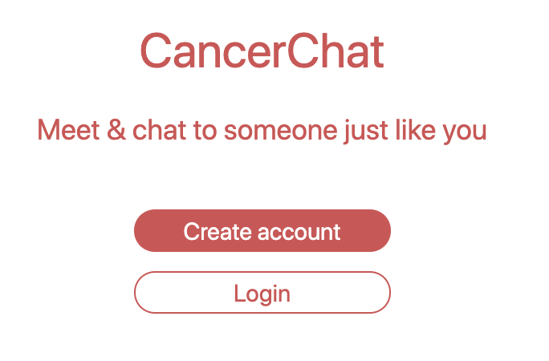
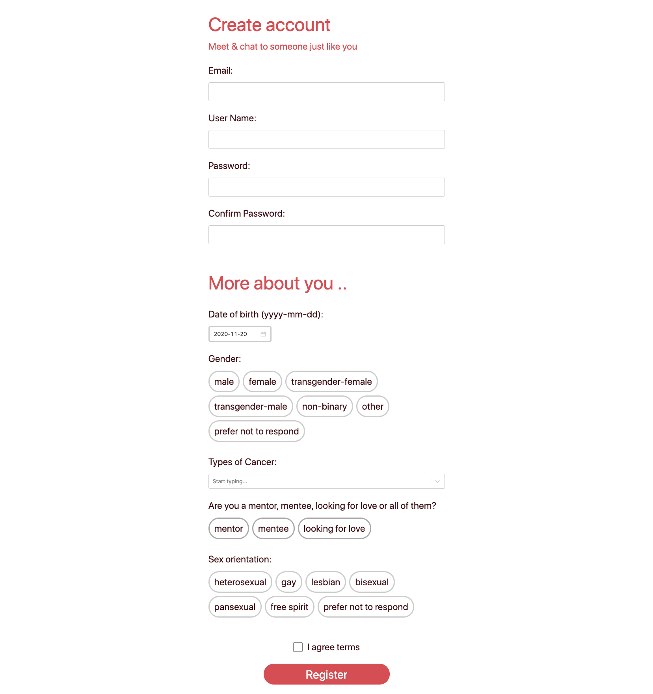
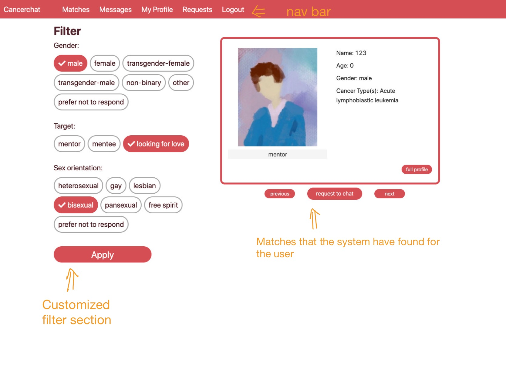
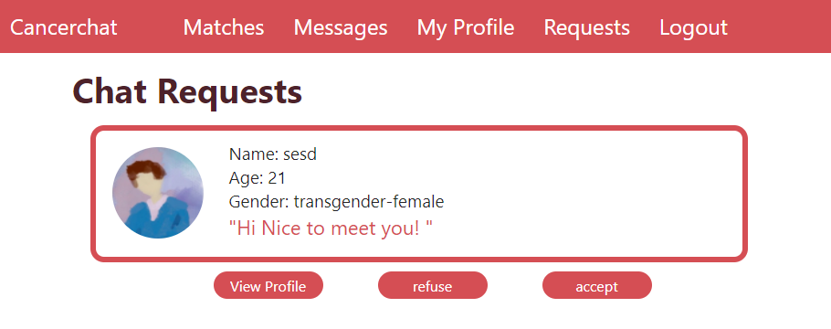
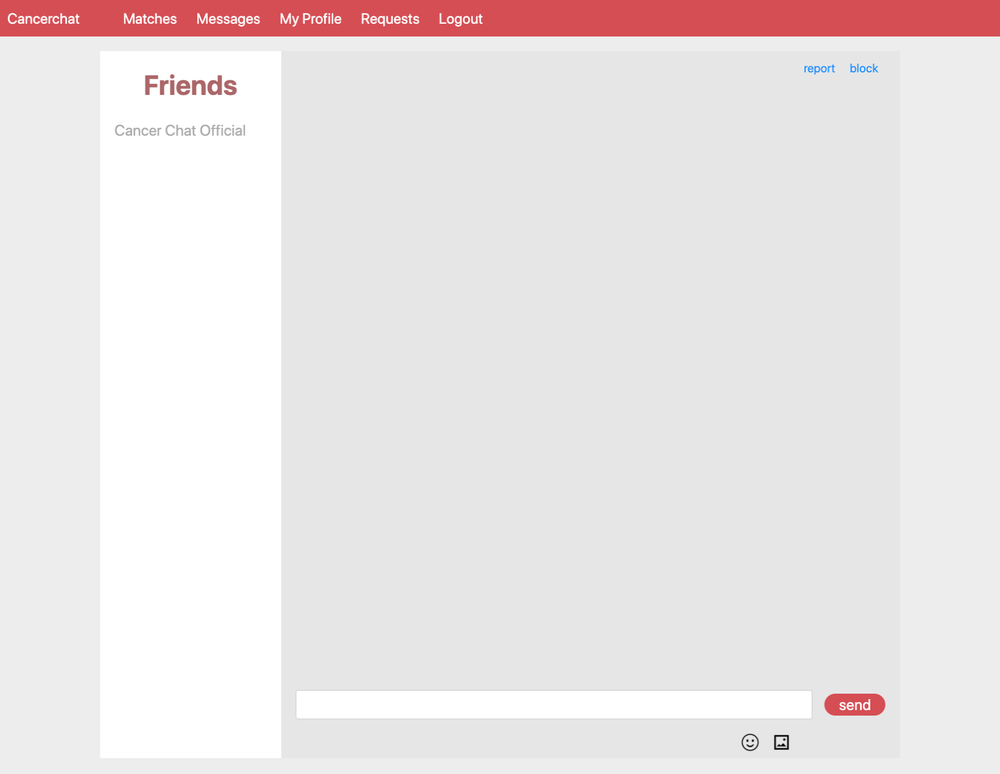
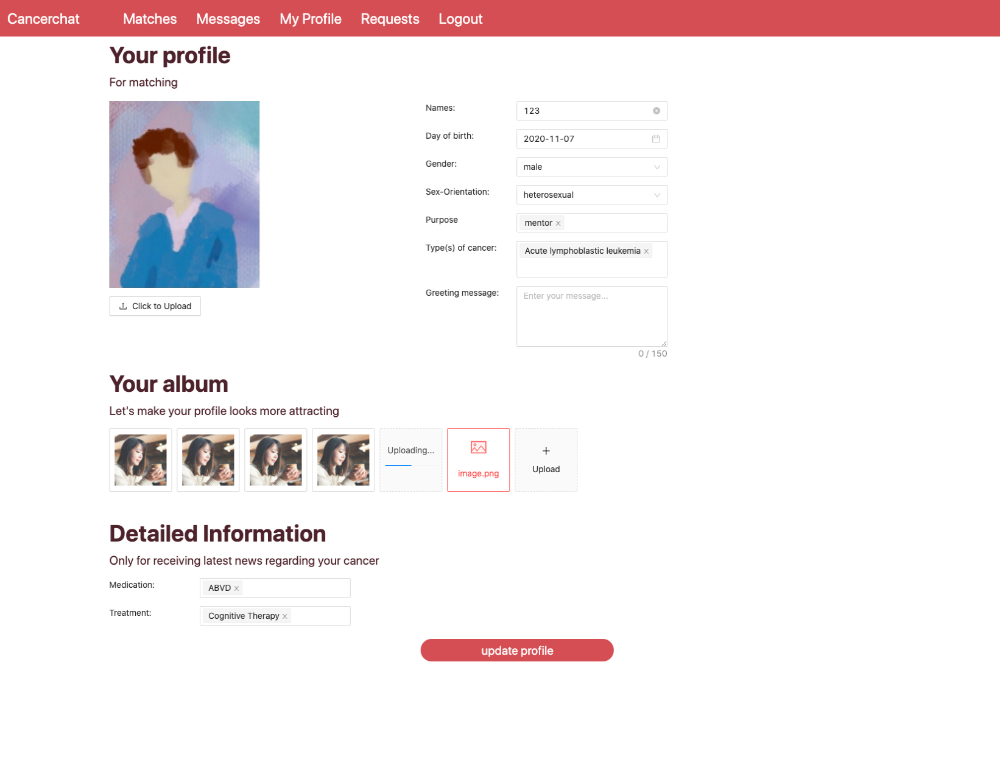
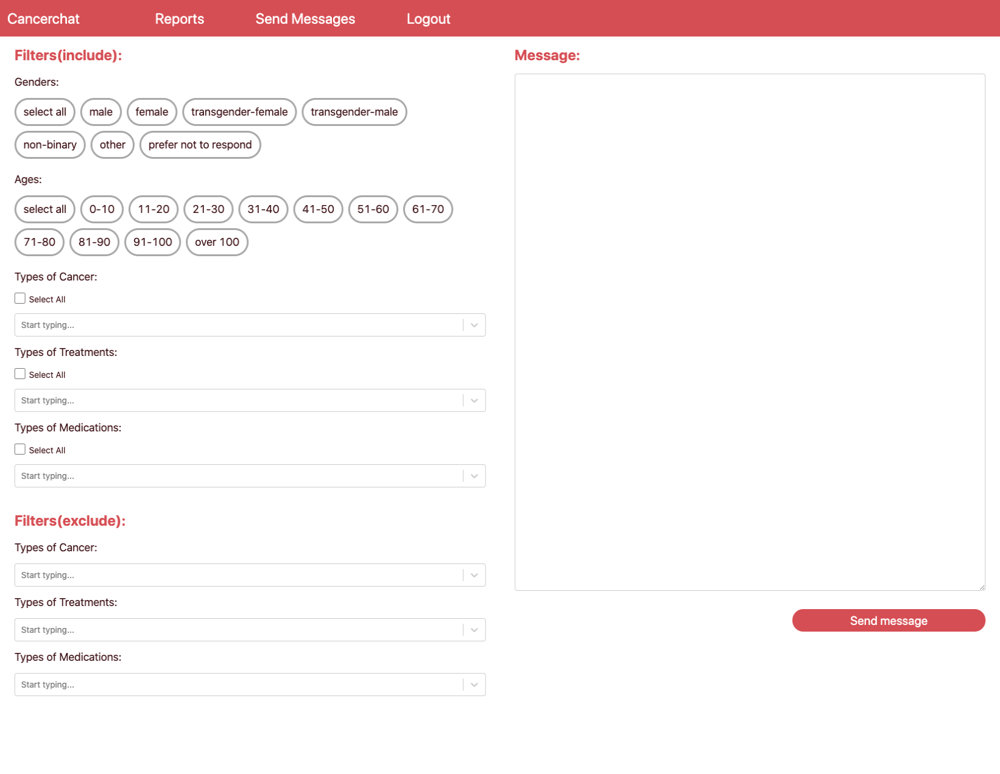

# CancerChat/Team 11

## Description 
 
 CancerChat is a Tinder-like app that serves as a platform, on which the cancer patients can be matched to other cancer patients that meet their requirements. Our app also has a built-in notification functionality where the administrators can send cancer-related news to target users. The administrators are from Malecare, a cancer survivor support nonprofit organization.
 
 Our app focuses on a social issue that has long been ignored -- the social problem of cancer patients. Because of their cancer, it could be difficult for them to find dates on other social platforms. As cancer patients, they may have more social needs than others do. Socializing helps them through the difficulties they met during cancer treatment, and to relieve their inner loneliness.
 
 To address this problem, our app provides a platform where the cancer patients can meet other cancer patients, either they want to date or find themselves a mentor or mentee. There is no such app on the market currently that does what our app does. We will match users who are close to each other and having the same type(s) of cancer since they may be interested in meeting each other in reality to expand their social circles and significantly improve their life quality.

What's more, because the administrators can send news about new treatments on CancerChat, it's also a great platform where the patients can receive the latest information about their cancer. Patients used to get information about new treatments when they met their doctors， while this app allows them to directly access this piece of information. They can then contact the doctor and ask if the new treatment can be applied to them. It can make cancer patients’ lives better and even save their lives.

## Key Features
 
### Create Account:  
When the users first visit CancerChat, they can use the button on the welcome page to create an account.
At the signup page, users will be asked to enter some basic account information (email, user name, birth date and password, etc.), as well as their purpose of using this app (find mentor, mentee or love) as well as their cancer types. After registering, they will be automatically directed to the main page.

### Login:  
On the login page, users can log in with their email and password. Besides, users can click on the checkbox and let CancerChat app remember your email account.

### Navigation bar:  
After logging in, there is a navigation bar on the top, and users can click on them and be redirected to the according page.

### Browse matches:  
On the main page, there will be matched users provided by the CancerChat app. Users can choose to view the full profile of the matched user or request to have a chat with this user. They will be matched to someone who has the same types of cancer as they do.
Next to the current match, users can change the filters to ask for matches that meet their requirements.
Since the CancerChat app provides multiple matches for users, they can switch matches with the previous and next buttons on the matches page. 

### Chat:  
The users will become friends after both users agree on the chat request, and they will be de-friended unless one of them has been blocked by the other. On the message page, users can find their friends on the left. Users can click on a friend's user name and start a chat by sending texts to friends. Messages received offline are loaded once users go online.

### Update Profile:  
Users can modify their profile on the profile page. Profile not only includes the basic information but also some extra information such as the greeting message users want to show to other users on the matches page. Users can also add detailed information including the medications they are taking and the treatments they are using, for the purpose of receiving the latest news of the treatments or medications from the admin. Note that a user has to fill in both sections(medication and treatment) to receive any news.

### Admin sends news:  
Administrators can send the news to target users using the filters including ages, genders, types of cancer, types of treatment, and types of medication. For example, administrators can send news about the latest lung cancer treatment to users with lung cancer aged 20-50.

## Instructions
 
 Note: The pictures here are just for reference. The actual website may be (slightly) different from those pictures.
 
 A user can visit our app at http://ec2-52-36-24-67.us-west-2.compute.amazonaws.com:5000. One thing to notice is that the chat and send admin message feature is not working as expected on the deployed version. Our chat and send admin message feature relies on the flask-socketio module, which works perfectly fine on the local version. However, after deploying the app, the socket stopped working and the whole team dedicated a lot of time trying to fix this issue but couldn't manage to get it done in D2. We will fix the chat functionality in D3. 
 
 If you want to test the chat feature, please git clone our repository to the local system and follow the instructions listed under Development Requirements section below, and the chat feature should work without any issue.
 
 
 Below is the welcome page of CancerChat:
 

 
 Our app has two types of users: normal users and administrators.
 
 ### Common user
 As a normal user, one can either register a new account or log in as an existing user. We have created a demo user for testing, and the credentials would be: email: my_cancer3@gmail.com, pwd: my_cancer2, 
or you can click the Create Account button and create a new user:

 
 After logging in, the user will see the matching page. To test match functionality, you can create several accounts through signup page and try to match them. Note that only users who have some types of cancer in common can be matched to each other. 
 
 
 If the user wants to talk to the match, then he/she can click the "request to chat" button user the matched user, then the matched user would receive a request on their requests page:
  
 
 
 To test the chat functionality, we have provided two accounts that are already friended:
 
   - email: my_cancer3@gmail.com
   - pwd: my_cancer2
   - email: my_cancer6@gmail.com
   - pwd: my_cancer2
 
 Please open two two different browsers (for example, ie and Chrome or Safari and Chrome) and sign in as two users respectively and you'll find each other in the chat page. The send emoji and pictures feature has not been implemented, and will be finished in D3.
 
 The user can view and update their profile on the profile page. Note that the uploading photos feature has not been supported and will be finished in D3.
  
  
 
 ### Admin user
 As an admin, we have provided a pre-set admin account: 
 
 email: CancerChatAdmin@gmail.com
 password: Admin
 
  After logging in, the user will be redirected to the admin send message page. The reports page will be implemented in D3.
   
   This page is where the admin can send messages to a specific group of users. we have both a include section and a exclude section to handle the case where the admin may want to send a message to the users who have lung cancer but are not receiving the Antibody treatment. To test this feature, please open an incognitive and sign in as admin, and open another incognitive window and sign in as a normal user. Note that only users who fill in the both sections under the detailed information in their profile page can receive admin's message.
 
 ## Development requirements
 
 - Installation of npm, node, python3, python3-pip, flask are required. Python packages requirements has shown in requirements.txt. 
 - Instructions for setting up and running the application:
   - Open the deliverable-2 folder:
     - Open one terminal for backend:
     - Step 1:
        - go to backend folder: `cd backend`
        - install requirements using pip: `pip install -r requirements.txt` or `pip3 install -r requirements.txt`
     - Step 2:
        - if your operation system is MacOS/Linux, please `export FLASK_APP=app/cancer_chat.py`
        - if your operation system is Windows, please `set FLASK_APP=app/cancer_chat.py`
     - Step 3:
        - `flask run`
     - Open another terminal for frontend:
     - Step 1:
        - `cd frontend`
     - Step 2:
        - `npm i`
     - Step 3:
        - `npm start`
        
 ## Deployment and Github Workflow

- Main development process happens on the `develop` branch. This is for preventing from contaminating the master branch. https://github.com/csc301-fall-2020/team-project-11-malecare-cancer-support/tree/develop

- If changes that are risky and may contaminate the whole codebase are needed...
   - Start a new branch from the `develop` branch, examples:
      - `tell_user_loading` branch. It adds the functionality to every webpage to tell the user that the resources are being loaded. https://github.com/csc301-fall-2020/team-project-11-malecare-cancer-support/tree/tell_user_loading
      - `import_bug_fix` branch. It changes the file structure of the back-end to resolve some of python's import errors. https://github.com/csc301-fall-2020/team-project-11-malecare-cancer-support/tree/import_bug_fix
      - ...and some more branches can be found under https://github.com/csc301-fall-2020/team-project-11-malecare-cancer-support/branches
   - Do a pull-request when finish fixing the bug/adding new functionalities
      - If an automerge to develop branch is available, do the automerge
      - If a manually merging is needed, merge `develop` branch to the new branch manually. Test the merged code at the local machine and make sure it is stable. Then do a pull-request to merge the new branch back to the `develop` branch. The reason for this is that we do not want any unstable code in the `develop` branch.
      - Examples of the pull-requests can be found here: https://github.com/csc301-fall-2020/team-project-11-malecare-cancer-support/pulls?q=is%3Apr+is%3Aclosed
      - we did not enforce this practice at first. We are adapting to it since we believe that it helps to maintain a cleaner codebase.
   - Invite someone who is available at the time or someone who is in charge of the changed code to do a code review. Sometimes we have to change to the code which was not the part that was assigned to us, thus it is necessary to consult the person who was in charge of the code. However, this does not often happen, since we first ask the person who is in charge of the piece of the code to make the change. If this does happen, then the review is definitely needed. The reason is that we do not want our code to be changed without being notified, which could result in hard-to-find bugs.
   - Once the pull-request is approved, go ahead to merge it to the `develop` branch. Usually, the person who creates the pull-requests is responsible for merging the branch, but it does not matter, since the conflicts are resolved earlier and the changes are approved by others.

- Most of the time, developers stay on the develop branch to stay in sync with each other and made quick responses to others' suggestions.

- Once we reach a big milestone(a working MVP for D2 would be considered as a milestone), we use pull-requests to merge the `develop` branch to the `master` branch.

- Once it is time to deploy, extra configurations are needed. Therefore we have a separate branch called `deploy_preparation` for release. https://github.com/csc301-fall-2020/team-project-11-malecare-cancer-support/tree/deploy_preparation

### How and when to test
- Every push and pull-request, we run our app at our local machines to test it. 
- UI tests are done by manually clicking on the UI to make sure they are reliable to use and won't crash easily. 
- Postman is used to test the back-end. It is an API testing tool. It is used to manually send requests to the API and see if the correct responses are sent back.
- MongoDBCompass, a GUI for MongoDB, is used to monitoring the changes happen in the database, since some of API test and UI test may result in changes in our database.

### Deployment
- Deploy to AWS EC2.
- AWS console is used to help us deploy the app.
- Deployment process:
   - Choose Ubuntu 20.0 as AMI
   - Create a new EC2 instance
   - `ssh` to the instance
   - Clone our project from Github to the instance
   - Checkout `deploy_preparation` branch
   - Install requirements
   - In frontend folder, run:
    - `npm i`
    - `npm run build:prod`
   - set path to backend folder, run:
    - `export FLASK_APP=app/cancer_chat.py`
    - `nohup flask run --host=0.0.0.0 &`

Note that the main difference between the commands for deployment and development is that deployment requires `build`, which is the main reason why we have a separate branch for deployment. We do not want to run `build` when developing the app, since it is time-consuming. We also have different .env files in the `deploy_preparation` branch for setting up the production environment. Replacing `npm run build:prod` with `npm run build:dev` at local machine can make the deployed version run locally. It works fine, too.
   

 ## Licenses 

We will apply MIT license to our codebase. 
Further development and use of our codebase have to also stay under MIT license and include the copyright notice. 
Apart from that, the codebase can be used in any way the users wish. 
We made this choice because our partner may want to further develop this software and we also want a copyright notice for our software.
